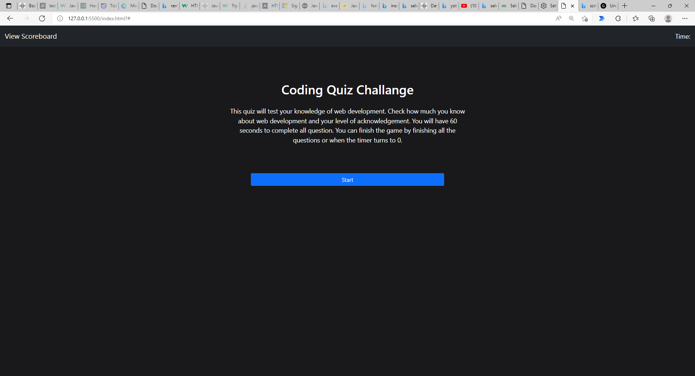
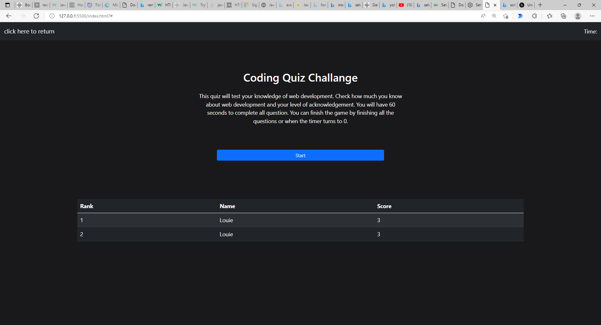
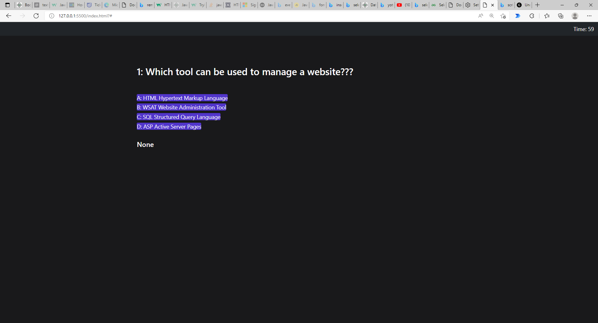
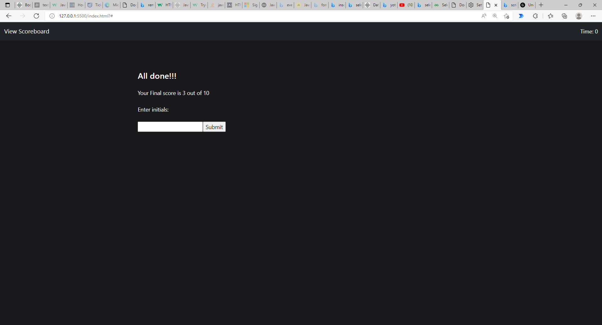

# code-quiz
A code quiz
## Description

This is a website of coding quiz

## Table of Contents

-[Installation]
-[Usage]
-[Credit]
-[License]
-[Feature]

## Installation

There are no steps required for installation. You only require a web browser of the following (Chrome, Brave, Edge, etc.) to open up the webpage to view the content.

## Usage

## Credit

Louie Ip, GitHub for storage and hosting, Bootstrap for providing some of the css look

## License
 
blank

## Features

Webpage allows you to test your coding knowledge about web dev with .NET platform. You also can compare results.

## Deployed Link

https://louieiply.github.io/code-quiz/

